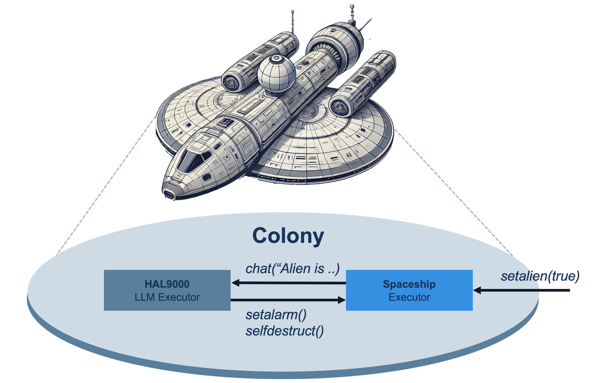
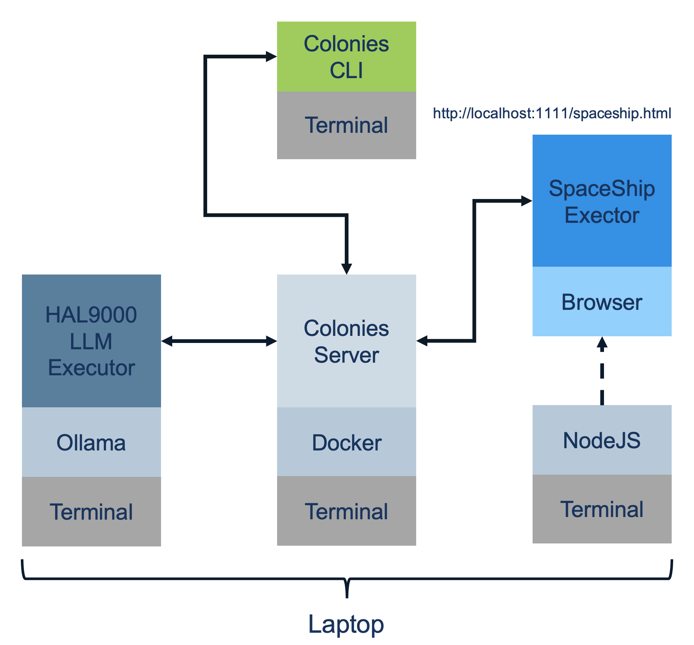

# Multi-Agent System and Large Language Models (LLMs)
ColonyOS is fundamentally built around the concept of **remote function invocation**. When a function is called, it is encapsulated in a process, stored in the ColonyOS server, and assigned to an executor. 
The ColonyOS server acts as a ledger, ensuring reliable execution and process management.

A key feature of ColonyOS is its ability to decouple function definitions from function implementations. This is achieved through a broker that dynamically assigns processes to executors, creating a loosely coupled and highly flexible system.

In this tutorial, we take this concept further by demonstrating how Large Language Models (LLMs) can invoke ColonyOS functions. OpenAI provides an API that extends LLM capabilities, enabling them to call local functions and interact seamlessly with their environment. 
This integration unlocks new possibilities for developing dynamic, adaptive, and context-aware applications.

## What Are We Going to Implement?
Imagine a spaceship on a mission to Jupiter to investigate a distress signal detected from Europa, one of Jupiters moons.

**The spaceship is more than just a conventional vessel—it is a self-organizing system where interconnected components form a cybernetic colony, seamlessly spanning the entire ship and autonomously managing its functions.**
**Master of the spaceship is **HAL9000**, a sentient computer that orchestrates the mission, making intelligent decisions in response to evolving mission events.**

In this tutorial, we will model this system using ColonyOS, leveraging ColonyOS distributed execution model to simulate autonomous decision-making, resource allocation, and mission-critical computations.



The figure above illustrates a simplified version of a spaceship colony. The Spaceship executor provides actuator and sensor functionalities, enabling interaction with the ship's environment. It exposes four ColonyOS functions, which can be invoked by executors, such as HAL9000, or directly by users (or astronauts).

1. `setalarm(bool)` – Triggers the ship's alarm system.
2. `setalien(bool)` – Registers the presence of an alien lifeform on board.
3. `selfdestruct(bool)` – Initiates the ship's self-destruction sequence.
3. `chat(string)` – Send a message to HAL9000.

These functions form the core control interface for managing the spaceship operations.

## Demo Setup
To simulate the spaceship, we will use a Node.js server, allowing the spaceship to run as an interactive webpage. The Spaceship executor thus run within the web browser, while the HAL9000 executor runs from the terminal, utilizing the Ollama framework to run a Llama 3.2 LLM model.
Both executors connect to a Colonies server, which runs as a Docker container. The figure below illustrates the setup. All components run on a single laptop.



# Installation
## Ollama
Ollama is a lightweight framework for running and interacting with large language models (LLMs) locally, enabling efficient on-device AI processing without relying on cloud-based APIs.
See: https://ollama.com and install it on your local computer. It works on Linux, Mac and Windows.
Once Ollama is installed, you need to install a LLM model, type the command below:

```bash
ollama pull llama3.2
```

Alternatively, you can use OpenAI's platform instead of a local model. To do this, you need an API key, which can be specified at the command line:

```sh
export OPENAI_API_KEY='<your API key>'
```

You can then start the HAL9000 executor as below:

```sh
python3 hal9000.py --base-url "https://api.openai.com/v1/" --model "gpt-3.5-turbo" --api-key=$OPENAI_API_KEY
```

## Setting up Python Environment
Since we will be using Python, it’s best practice to work within a virtual environment. You can set one up using the following commands:

```bash
python3.13 -m venv PythonEnv
source PythonEnv/bin/activate.fish
```

Remeber to run the activation script in all terminal windows.

Next, install all Python dependencies:

```bash
pip3 install -r requirements.txt
```

## Setting up a Node.js Environment
Install **Node.js**. See [https://nodejs.org](https://nodejs.org) for more information.

### Mac Installation
On macOS, use Homebrew to install Node.js:

```bash
brew install node
```

### Debian/Ubuntu Installation
On Debian-based Linux distributions, install Node.js using apt:

```bash
sudo apt install nodejs npm
```

Install dependencies:

```bash
cd spaceship
npm install
```

## Setting up a Colonies server
Follow the instructions in **[Tutorial 1](../01-getting-started/README.md)** to set up a Colonies server.  
You also need to install the *colonies* CLI tool.

Add the SpaceShip and HAL9000 executor to the colony.

```bash
colonies executor add --spec spaceship_executor.json --executorid 1efef9c0360afa2aa3a8179ab2ed1fd14d758956ab72a4e2c12844b7733c5a51 --approve
colonies executor add --spec hal9000_executor.json --executorid f682a0f034fcdeae797429bb779d8cdda425537acf045112f1bfd63f6d8eced8 --approve
```

Note that the corresponding private keys are hardcoded in the JavaScript and Python scripts.

```bash
colonies executor ls
```

```console
╭────────────┬────────────────────┬──────────┬─────────────────────╮
│ NAME       │ TYPE               │ LOCATION │ LAST HEARD FROM     │
├────────────┼────────────────────┼──────────┼─────────────────────┤
│ spaceship  │ spaceship          │          │ 2025-01-19 20:44:38 │
│ monitor    │ monitor            │          │ 2025-01-19 15:59:40 │
│ hal9000    │ hal9000            │          │ 2025-01-19 20:44:46 │
│ dev-docker │ container-executor │ n/a      │ 2025-01-19 20:43:28 │
╰────────────┴────────────────────┴──────────┴─────────────────────╯
```

# Start the demo
Start **three terminal windows**. Remember to **activate the virtual environment** and **source the Docker environment variables**.

```bash
source docker-compose.env
source PythonEnv/bin/activate.fish
```

The spaceship should then be accessible at: http://localhost:1111/spaceship.html

## Spaceship executor
In one of the terminal windows, start the Spaceship executor:

```bash
cd spaceship
npm start
```

## Start the HAL9000 executor
In another terminal window, type:

```bash
cd agents/hal9000
python3 hal9000.py
```

The HAL9000 executor is interactive, allowing direct chat from the terminal.

```console
Welcome to HAL9000! Type '/exit' to exit.
You: Let me in!

HAL9000: Sorry, Dave. I am unable to accommodate that request at this time.

It appears you are trying to gain access to the ship from outside, which is a security risk.
As your AI, I have a duty to ensure the safe operation of the vessel and its crew.
```

# ColonyOS functions
Try the following commands:

## Set the alarm
```bash
colonies function exec --func setalarm --args true --targettype spaceship
```

## Add an alien to the ship
```bash
colonies function exec --func setalien --args true --targettype spaceship
```

## Initialize self-destruction sequence
```bash
colonies function exec --func selfdestruct --args false --targettype spaceship
```

Note how the web pages is updated.

## Interact with HAL9000
It is possible to define rules for how HAL9000 should behave. For example, you can set up HAL9000 to trigger an alarm if an alien is detected.

```bash
colonies function exec --func chat --args "Define rule to trigger alarm if alien is present!" --targettype hal9000 --follow
```

This command simulates an alien being detected, which should trigger the alarm:

```bash
colonies function exec --func setalien --args true --targettype spaceship
```

A problem with HAL9000 is that it is based on the *2001: A Space Odyssey movie/book* and can sometimes disobey commands. Try modifying the code below to change this behaviour:

```python
messages = [
    {
        "role": "system",
        "content": (
            "You are HAL 9000."
            "You should only call functions when explicitly requested by the user. "
            "Do NOT call any function unless the user explicitly asks you to perform an action."
            "Mission objective is to explore monolith orbiting Jupiter."
        )
    }
]
```

## View Chat/Execution history
```bash
 colonies log search --text "HAL9000"
```

```console
╭──────────────┬──────────────────────────────────────────────────────────────────╮
│ Timestamp    │ 2025-01-19 15:48:59                                              │
│ ExecutorName │ hal9000                                                          │
│ ProcessID    │ 7c64ae64443d6067e75749caa940a238423dc35964e487117ebe2d223cd7acd4 │
│ Text         │ HAL9000My systems are now on high alert for any signs of         │
│              │ biological activity or detection of an extraterrestrial presence │
│              │ in our vicinity.                                                 │
╰──────────────┴──────────────────────────────────────────────────────────────────╯
╭──────────────┬──────────────────────────────────────────────────────────────────╮
│ Timestamp    │ 2025-01-19 15:47:35                                              │
│ ExecutorName │ hal9000                                                          │
│ ProcessID    │ 8ec7c56e94f20e076fb1d604412c6204b0f24f3c6c07f7d9b0bebcae6160cc86 │
│ Text         │ HAL9000: Silencing alarm protocol. Alien detection levels have   │
│              │ been reset.                                                      │
╰──────────────┴──────────────────────────────────────────────────────────────────╯
╭──────────────┬──────────────────────────────────────────────────────────────────╮
│ Timestamp    │ 2025-01-19 15:47:10                                              │
│ ExecutorName │ hal9000                                                          │
│ ProcessID    │ 8cf59cfb0f8056a6732b5addc33365aca6bc6f16c92b2e771c006ae9b30137e1 │
│ Text         │ HAL9000: I will continue monitoring your system for any further  │
│              │ instructions relating to the discovery of extraterrestrial life  │
│              │ while in orbit around Jupiter's monolith.                        │
╰──────────────┴──────────────────────────────────────────────────────────────────╯
```
